- [Вопросы к экзамену по дисциплине «Математическое и компьютерное моделирование»](#вопросы-к-экзамену-по-дисциплине-математическое-и-компьютерное-моделирование)
  - [1. Понятие математического моделирования](#1-понятие-математического-моделирования)
    - [Детерминированные математические модели](#детерминированные-математические-модели)
    - [Стохастическая математическая модель](#стохастическая-математическая-модель)
  - [2. Структурные и функциональные модели](#2-структурные-и-функциональные-модели)
    - [Структурные модели](#структурные-модели)
      - [Примеры структурных моделей](#примеры-структурных-моделей)
      - [Пример ER-диаграммы](#пример-er-диаграммы)
    - [Функциональные модели](#функциональные-модели)
      - [Примеры функциональных моделей](#примеры-функциональных-моделей)
    - [Сравнение структурных и функциональных моделей](#сравнение-структурных-и-функциональных-моделей)
  - [3. Содержательные (концептуальные) и формальные модели](#3-содержательные-концептуальные-и-формальные-модели)
    - [Характеристики содержательных (концептуальных) моделей](#характеристики-содержательных-концептуальных-моделей)
      - [Примеры содержательных моделей](#примеры-содержательных-моделей)
      - [Пример концептуальной диаграммы](#пример-концептуальной-диаграммы)
    - [Характеристики формальных моделей](#характеристики-формальных-моделей)
      - [Примеры формальных моделей](#примеры-формальных-моделей)
    - [Сравнение содержательных и формальных моделей](#сравнение-содержательных-и-формальных-моделей)
  - [4. Аналитические и имитационные модели](#4-аналитические-и-имитационные-модели)
    - [Аналитические и имитационные модели](#аналитические-и-имитационные-модели)
      - [Характеристики аналитических моделей](#характеристики-аналитических-моделей)
      - [Примеры аналитических моделей](#примеры-аналитических-моделей)
    - [Имитационные модели](#имитационные-модели)
      - [Характеристики имитационных моделей](#характеристики-имитационных-моделей)
      - [Примеры имитационных моделей](#примеры-имитационных-моделей)
    - [Сравнение аналитических и имитационных моделей](#сравнение-аналитических-и-имитационных-моделей)
  - [5. Понятие компьютерного моделирования](#5-понятие-компьютерного-моделирования)
    - [Основные характеристики компьютерного моделирования](#основные-характеристики-компьютерного-моделирования)
    - [Процесс компьютерного моделирования](#процесс-компьютерного-моделирования)
    - [Преимущества и недостатки компьютерного моделирования](#преимущества-и-недостатки-компьютерного-моделирования)
  - [6. Примеры математических моделей](#6-примеры-математических-моделей)
    - [1. Модель роста популяции (Модель Мальтуса)](#1-модель-роста-популяции-модель-мальтуса)
      - [Уравнение](#уравнение)
      - [Решение](#решение)
    - [2. Модель хищник-жертва (Модель Лотки-Вольтерры)](#2-модель-хищник-жертва-модель-лотки-вольтерры)
      - [Уравнения](#уравнения)
    - [3. Модель диффузии (Уравнение теплопроводности)](#3-модель-диффузии-уравнение-теплопроводности)
      - [Уравнение](#уравнение-1)
    - [4. Модель эпидемии (SIR-модель)](#4-модель-эпидемии-sir-модель)
      - [Уравнения](#уравнения-1)
    - [5. Модель линейного программирования](#5-модель-линейного-программирования)
      - [Формулировка задачи](#формулировка-задачи)
    - [6. Модель Ньютона (Законы движения)](#6-модель-ньютона-законы-движения)
      - [Уравнение $F = ma$](#уравнение-f--ma)
    - [7. Модель Курно (Экономическая модель)](#7-модель-курно-экономическая-модель)
      - [Уравнение](#уравнение-2)
  - [7. Сложные системы как объект моделирования. Взаимодействие видов моделирования](#7-сложные-системы-как-объект-моделирования-взаимодействие-видов-моделирования)
    - [Сложные системы как объект моделирования](#сложные-системы-как-объект-моделирования)
      - [Примеры сложных систем](#примеры-сложных-систем)
    - [Взаимодействие видов моделирования](#взаимодействие-видов-моделирования)
      - [Основные виды моделей](#основные-виды-моделей)
        - [1. Аналитические модели](#1-аналитические-модели)
        - [2. Концептуальные (содержательные) модели](#2-концептуальные-содержательные-модели)
        - [3. Формальные модели](#3-формальные-модели)
        - [4. Имитационные модели](#4-имитационные-модели)
      - [Основные типы взаимодействия различных типов моделей](#основные-типы-взаимодействия-различных-типов-моделей)
  - [8. Схема построения и исследования моделей сложных систем](#8-схема-построения-и-исследования-моделей-сложных-систем)
  - [9. Имитационное моделирование как средство для интеграции моделей различных классов](#9-имитационное-моделирование-как-средство-для-интеграции-моделей-различных-классов)
  - [10. Основные виды имитационного моделирования](#10-основные-виды-имитационного-моделирования)
    - [Дискретно-событийное моделирование (DES)](#дискретно-событийное-моделирование-des)
    - [Системная динамика](#системная-динамика)
    - [Агентное моделирование](#агентное-моделирование)
    - [Комбинированное моделирование](#комбинированное-моделирование)
  - [11. Дискретно-событийное моделирование](#11-дискретно-событийное-моделирование)
  - [12. Агентное моделирование. Принципы построения агентных моделей](#12-агентное-моделирование-принципы-построения-агентных-моделей)
  - [13. Многоагентная система. Техника разработки и программная реализация агентных моделей](#13-многоагентная-система-техника-разработки-и-программная-реализация-агентных-моделей)
    - [Аспекты которые необходимо учитывать в программной реализации многоагентной модели](#аспекты-которые-необходимо-учитывать-в-программной-реализации-многоагентной-модели)
  - [14. Агрегативные модели. Кусочно-линейный агрегат](#14-агрегативные-модели-кусочно-линейный-агрегат)
    - [Агрегативные модели](#агрегативные-модели)
    - [Кусочно-линейный агрегат](#кусочно-линейный-агрегат)
      - [Основные характеристики кусочно-линейного агрегата](#основные-характеристики-кусочно-линейного-агрегата)
  - [15. Схема сопряжения. Агрегативная система](#15-схема-сопряжения-агрегативная-система)
    - [Схема сопряжения](#схема-сопряжения)
    - [Агрегативная система](#агрегативная-система)
  - [16. Сети Петри и их расширения. Описание структур моделируемых проблемных ситуаций в виде сетей Петри](#16-сети-петри-и-их-расширения-описание-структур-моделируемых-проблемных-ситуаций-в-виде-сетей-петри)
    - [Сети Петри и их расширения](#сети-петри-и-их-расширения)
      - [Введение в сети Петри](#введение-в-сети-петри)
      - [Основные компоненты сетей Петри](#основные-компоненты-сетей-петри)
      - [Пример простой сети Петри](#пример-простой-сети-петри)
    - [Расширения сетей Петри](#расширения-сетей-петри)
    - [Описание структур проблемных ситуаций с помощью сетей Петри](#описание-структур-проблемных-ситуаций-с-помощью-сетей-петри)
      - [Пример моделируемой проблемной ситуации: Управление производственной линией](#пример-моделируемой-проблемной-ситуации-управление-производственной-линией)
      - [Моделирование ситуации с помощью сети Петри](#моделирование-ситуации-с-помощью-сети-петри)
      - [Описание модели](#описание-модели)
    - [Заключение](#заключение)
  - [17. Модели системной динамики. Парадигма и методы системной динамики](#17-модели-системной-динамики-парадигма-и-методы-системной-динамики)
    - [Модели системной динамики](#модели-системной-динамики)
      - [Парадигма системной динамики](#парадигма-системной-динамики)
      - [Методы системной динамики](#методы-системной-динамики)
        - [1. Качественное моделирование](#1-качественное-моделирование)
        - [2. Количественное моделирование](#2-количественное-моделирование)
        - [3. Математическое моделирование](#3-математическое-моделирование)
        - [4. Компьютерное моделирование](#4-компьютерное-моделирование)
      - [Пример применения методов системной динамики](#пример-применения-методов-системной-динамики)
    - [Заключение](#заключение-1)
  - [18. Общая структура моделей системной динамики. Основные символы потоковых диаграмм моделей системной динамики](#18-общая-структура-моделей-системной-динамики-основные-символы-потоковых-диаграмм-моделей-системной-динамики)
    - [Общая структура моделей системной динамики](#общая-структура-моделей-системной-динамики)
    - [Компоненты моделей системной динамики](#компоненты-моделей-системной-динамики)
      - [1. Накопления (Stocks)](#1-накопления-stocks)
      - [2. Потоки (Flows)](#2-потоки-flows)
      - [3. Переменные (Auxiliary Variables)](#3-переменные-auxiliary-variables)
      - [4. Параметры (Parameters)](#4-параметры-parameters)
      - [5. Обратные связи (Feedback Loops)](#5-обратные-связи-feedback-loops)
      - [6. Задержки (Delays)](#6-задержки-delays)
      - [Пример структуры модели системной динамики](#пример-структуры-модели-системной-динамики)
        - [Объяснение модели](#объяснение-модели)
      - [Заключение](#заключение-2)
    - [Основные символы потоковых диаграмм моделей системной динамики](#основные-символы-потоковых-диаграмм-моделей-системной-динамики)
      - [1. Накопления (Stocks)](#1-накопления-stocks-1)
      - [2. Потоки (Flows)](#2-потоки-flows-1)
      - [3. Переменные (Auxiliary Variables)](#3-переменные-auxiliary-variables-1)
      - [4. Параметры (Parameters)](#4-параметры-parameters-1)
      - [5. Обратные связи (Feedback Loops)](#5-обратные-связи-feedback-loops-1)
      - [6. Задержки (Delays)](#6-задержки-delays-1)
    - [Таблица с основными графическими отображениями](#таблица-с-основными-графическими-отображениями)
    - [Пример использования основных символов в потоковой диаграмме](#пример-использования-основных-символов-в-потоковой-диаграмме)
    - [Объяснение модели](#объяснение-модели-1)
    - [Заключение](#заключение-3)
  - [19. Понятие о модельном времени. Механизм продвижения модельного времени. Дискретные и непрерывные имитационные модели](#19-понятие-о-модельном-времени-механизм-продвижения-модельного-времени-дискретные-и-непрерывные-имитационные-модели)
    - [Понятие о модельном времени](#понятие-о-модельном-времени)
      - [Основные характеристики модельного времени](#основные-характеристики-модельного-времени)
      - [Заключение](#заключение-4)
    - [Механизм продвижения модельного времени](#механизм-продвижения-модельного-времени)
      - [1. Фиксированный временной шаг (Time Stepping)](#1-фиксированный-временной-шаг-time-stepping)
      - [2. Событийное продвижение времени (Event-Based Time Advancement)](#2-событийное-продвижение-времени-event-based-time-advancement)
        - [Пример с использованием фиксированного шага времени](#пример-с-использованием-фиксированного-шага-времени)
      - [Заключение](#заключение-5)
    - [Дискретные и непрерывные имитационные модели](#дискретные-и-непрерывные-имитационные-модели)
      - [Дискретные имитационные модели](#дискретные-имитационные-модели)
      - [Непрерывные имитационные модели](#непрерывные-имитационные-модели)
      - [Сравнение дискретных и непрерывных имитационных моделей](#сравнение-дискретных-и-непрерывных-имитационных-моделей)
      - [Пример использования обеих моделей для одной задачи](#пример-использования-обеих-моделей-для-одной-задачи)
      - [Заключение](#заключение-6)
  - [20. Проблемы стратегического и тактического планирования имитационного эксперимента. Направленный вычислительный эксперимент на имитационной модели](#20-проблемы-стратегического-и-тактического-планирования-имитационного-эксперимента-направленный-вычислительный-эксперимент-на-имитационной-модели)
    - [Проблемы стратегического и тактического планирования имитационного эксперимента](#проблемы-стратегического-и-тактического-планирования-имитационного-эксперимента)
      - [Стратегическое планирование](#стратегическое-планирование)
      - [Тактическое планирование](#тактическое-планирование)
      - [Сравнение стратегического и тактического планирования](#сравнение-стратегического-и-тактического-планирования)
      - [Заключение](#заключение-7)
    - [Направленный вычислительный эксперимент на имитационной модели](#направленный-вычислительный-эксперимент-на-имитационной-модели)
      - [Основные этапы проведения направленного вычислительного эксперимента](#основные-этапы-проведения-направленного-вычислительного-эксперимента)
      - [Пример направленного вычислительного эксперимента](#пример-направленного-вычислительного-эксперимента)
      - [Преимущества и недостатки направленного вычислительного эксперимента](#преимущества-и-недостатки-направленного-вычислительного-эксперимента)
      - [Заключение](#заключение-8)


# Вопросы к экзамену по дисциплине «Математическое и компьютерное моделирование»

## 1. Понятие математического моделирования

Математическое моделирование — это метод исследования, при котором строятся и изучаются математические модели объектов и процессов реального мира.

**Математическая модель представляет собой абстрактное описание системы с помощью математических понятий, таких как переменные, уравнения, функции и т. д.** Она позволяет исследовать свойства и поведение системы, предсказывать её реакцию на различные воздействия и находить оптимальные решения для управления ею.

Математические модели могут быть **детерминированными** или **стохастическими**

### Детерминированные математические модели

Это модели, в которых установлено взаимно-однозначное соответствие между переменными описывающими объект или явление.

### Стохастическая математическая модель

В таких моделях связи между переменными описывающими моделируемый объект носят случайный характер 

## 2. Структурные и функциональные модели

### Структурные модели

**Структурные модели(Статические)** описывают статические аспекты системы, ее структуру и внутренние компоненты. Они сосредотачиваются на организации элементов и взаимосвязях между ними. Основная цель структурных моделей — показать, из каких частей состоит система и как эти части взаимодействуют.

#### Примеры структурных моделей

1. **Диаграммы классов**:
   - Используются в объектно-ориентированном программировании.
   - Показывают классы, их атрибуты, методы и отношения между классами (наследование, ассоциации, агрегации).

2. **Диаграммы компонентов**:
   - Описывают физическую организацию программных компонентов.
   - Показывают, как программные модули и библиотеки объединяются для создания системы.

3. **Диаграммы сущность-связь (ER-диаграммы)**:
   - Используются в разработке баз данных.
   - Отображают сущности (таблицы) и связи между ними.

#### Пример ER-диаграммы

```plaintext
+-------------+            +-------------+
|  Student    |            |   Course    |
+-------------+            +-------------+
| StudentID   |<---------->| CourseID    |
| Name        |            | Title       |
| Enrollment  |            | Credits     |
+-------------+            +-------------+
```

### Функциональные модели

**Функциональные модели(Динамические)** описывают динамические аспекты системы, процессы и функции, которые она выполняет. Они фокусируются на поведении системы и на том, как данные проходят через различные процессы и трансформируются.

#### Примеры функциональных моделей

1. **Диаграммы потоков данных (DFD)**:
   - Показывают потоки данных через систему.
   - Описывают источники, приемники, процессы и хранилища данных.

2. **Диаграммы прецедентов (Use Case)**:
   - Используются в объектно-ориентированном анализе и проектировании.
   - Показывают взаимодействие между пользователями (акторами) и системой для выполнения различных функций.

3. **Диаграммы состояний**:
   - Описывают возможные состояния системы или ее компонентов и переходы между этими состояниями.
   - Полезны для моделирования поведения систем в ответ на различные события.

### Сравнение структурных и функциональных моделей

| **Характеристика**      | **Структурные модели**                       | **Функциональные модели**                   |
|-------------------------|----------------------------------------------|--------------------------------------------|
| **Фокус**               | Статическая структура системы                | Динамическое поведение системы             |
| **Основные элементы**   | Компоненты, классы, сущности и их связи      | Процессы, функции, потоки данных           |
| **Используемые диаграммы** | ER-диаграммы, диаграммы классов, диаграммы компонентов | DFD, диаграммы прецедентов, диаграммы состояний |
| **Цель**                | Описание внутренней структуры системы        | Описание функций и процессов системы       |

Обе модели являются важными инструментами для разработки и анализа сложных систем, предоставляя различные перспективы для более полного понимания системы.

Оба типа моделей могут быть полезны в различных областях, таких как инженерия, бизнес-анализ, медицина и другие. Структурные модели часто используются для проектирования и разработки систем, а функциональные — для анализа их производительности и оптимизации.

## 3. Содержательные (концептуальные) и формальные модели

**Содержательные (концептуальные) модели** описывают систему на высоком уровне абстракции, часто используя неформальные или полуформальные методы. Эти модели ориентированы на понимание и описание ключевых аспектов и концепций системы, без углубления в математические или формальные детали.

### Характеристики содержательных (концептуальных) моделей

- **Абстрактность**: Представляют основные идеи и концепции, игнорируя детали реализации.
- **Понятность**: Легко понимаются даже без глубоких знаний в предметной области.
- **Неформальность**: Часто описываются естественным языком, диаграммами или схемами.
- **Использование**: Применяются на ранних этапах проектирования для обсуждения идей и получения общего представления о системе.

#### Примеры содержательных моделей

1. **Концептуальные диаграммы**:
   - Используются для визуализации основных понятий и их взаимосвязей.
   - Например, концептуальные модели данных (ER-диаграммы) для баз данных.

2. **Ментальные модели**:
   - Описывают, как пользователи представляют себе систему и ее работу.
   - Используются в дизайне пользовательского интерфейса.

#### Пример концептуальной диаграммы

```plaintext
+-------------+       +-------------+
|   Customer  |------>|    Order    |
+-------------+       +-------------+
       |                    |
       v                    v
+-------------+       +-------------+
|   Payment   |       |  Shipment   |
+-------------+       +-------------+
```

**Формальные модели** описывают систему с использованием строго определенных математических методов и формализмов. Эти модели ориентированы на точное и однозначное описание системы, что позволяет проводить формальный анализ и проверку.

### Характеристики формальных моделей

- **Точность**: Обеспечивают однозначное и строгое описание системы.
- **Формальность**: Используют математические нотации и формализмы.
- **Проверяемость**: Позволяют проводить формальный анализ, верификацию и валидацию.
- **Использование**: Применяются для критических систем, где важна высокая степень надежности и корректности (например, в авиации, медицине, безопасности).

#### Примеры формальных моделей

1. **Автоматные модели**:
   - Используются для описания систем с дискретными состояниями.
   - Например, конечные автоматы, петри-сети.

2. **Логические модели**:
   - Описывают системы с помощью логических выражений и предикатов.
   - Например, модель проверяемости с помощью булевой логики.

3. **Дифференциальные уравнения**:
   - Используются для описания динамических систем, где важны изменения во времени.
   - Например, в физике, биологии, экономике.

### Сравнение содержательных и формальных моделей

| **Характеристика**          | **Содержательные (концептуальные) модели**        | **Формальные модели**                          |
|-----------------------------|---------------------------------------------------|------------------------------------------------|
| **Фокус**                   | Высокоуровневое представление концепций           | Строгое математическое описание                |
| **Абстрактность**           | Высокая                                           | Низкая (детализированная)                      |
| **Язык описания**           | Естественный язык, диаграммы                      | Математические нотации, формальные языки       |
| **Проверяемость**           | Неформальная, ограниченная                        | Формальная, высокая                             |
| **Использование**           | На ранних стадиях проектирования                  | Для критических систем, где важна надежность    |

Оба типа моделей играют важную роль в процессе разработки и анализа систем, предоставляя различные уровни абстракции и формализма в зависимости от целей и требований проекта.

## 4. Аналитические и имитационные модели

### Аналитические и имитационные модели

**Аналитические модели** используют математические формулы и уравнения для описания поведения системы. Эти модели позволяют получать точные и теоретически обоснованные решения путем решения уравнений и анализа формул.

#### Характеристики аналитических моделей

- **Точность**: Модели дают точные решения, если все предположения и упрощения корректны.
- **Простота**: Часто требуют значительных упрощений для получения решений.
- **Математическая строгость**: Основаны на строгих математических методах.
- **Ограничения**: Иногда трудны для применения к сложным или реальным системам из-за необходимости значительных упрощений.

#### Примеры аналитических моделей

1. **Линейное программирование**:
   - Используется для оптимизации линейных целевых функций при наличии линейных ограничений.

2. **Дифференциальные уравнения**:
   - Описывают динамические системы, например, движение жидкости или популяционную динамику.

3. **Теория вероятностей и статистика**:
   - Анализ вероятностных систем, расчет вероятностей событий и статистических характеристик.

### Имитационные модели

**Имитационные модели** используют компьютерные программы для воспроизведения поведения системы во времени. Эти модели позволяют исследовать сложные системы путем моделирования и анализа их работы при различных условиях.

#### Характеристики имитационных моделей

- **Гибкость**: Позволяют моделировать сложные системы с высокой степенью детализации.
- **Эмпиричность**: Требуют большого объема данных для верификации и валидации.
- **Визуализация**: Часто включают визуальные средства для отображения результатов.
- **Выходные данные**: Обеспечивают статистические данные и результаты имитаций, которые могут анализироваться.

#### Примеры имитационных моделей

1. **Агентное моделирование**:
   - Описывает систему как совокупность автономных агентов, взаимодействующих друг с другом и с окружающей средой.

2. **Монте-Карло моделирование**:
   - Использует случайные числа и статистику для моделирования и анализа вероятностных систем.

3. **Дискретно-событийное моделирование**:
   - Моделирует систему как последовательность дискретных событий, изменяющих состояние системы.

### Сравнение аналитических и имитационных моделей

| **Характеристика**      | **Аналитические модели**                           | **Имитационные модели**                          |
|-------------------------|----------------------------------------------------|--------------------------------------------------|
| **Методология**         | Математический анализ, решение уравнений           | Компьютерное моделирование, симуляция            |
| **Точность**            | Высокая при корректных предположениях               | Зависит от данных и параметров моделирования     |
| **Простота**            | Требуют упрощений и предположений                   | Могут быть очень сложными и детализированными    |
| **Гибкость**            | Ограниченная гибкость                              | Высокая гибкость и детализация                   |
| **Требования к данным** | Относительно низкие                               | Высокие, требуют детальных данных                |
| **Примеры применения**  | Оптимизация, динамические системы, теоретические исследования | Комплексные системы, операционные исследования, прогнозирование |

Аналитические модели полезны для теоретического анализа и оптимизации, в то время как имитационные модели предоставляют мощные инструменты для исследования и анализа сложных систем в реальных условиях.

## 5. Понятие компьютерного моделирования

**Компьютерное моделирование** — это использование компьютеров для создания и анализа моделей реальных систем. Оно позволяет изучать сложные процессы и явления, которые трудно или невозможно исследовать с помощью аналитических методов или экспериментальных исследований.

### Основные характеристики компьютерного моделирования

1. **Абстракция и симуляция**:
   - Модели создаются для представления ключевых характеристик и поведения реальных систем.
   - Компьютеры используются для имитации процессов и наблюдения за результатами.

2. **Использование вычислительных мощностей**:
   - Компьютеры выполняют сложные вычисления, которые могут быть невыполнимы вручную.
   - Позволяет моделировать большие и сложные системы с высокой степенью детализации.

3. **Интерактивность и визуализация**:
   - Модели могут быть интерактивными, позволяя пользователям изменять параметры и наблюдать изменения в реальном времени.
   - Результаты моделирования часто визуализируются в виде графиков, диаграмм или анимаций.

4. **Гибкость и адаптивность**:
   - Компьютерные модели легко изменяются и адаптируются для различных сценариев.
   - Позволяет проводить множество экспериментов с разными условиями.

### Процесс компьютерного моделирования

1. **Постановка задачи**:
   - Определение цели моделирования и ключевых вопросов для исследования.
   - Сбор данных и информации о реальной системе.

2. **Создание модели**:
   - Разработка математической или логической модели, описывающей систему.
   - Программирование модели с использованием подходящих языков и инструментов.

3. **Верификация и валидация**:
   - Проверка корректности модели (верификация).
   - Сравнение результатов модели с реальными данными для проверки её точности (валидация).

4. **Моделирование и анализ**:
   - Проведение экспериментов с моделью.
   - Анализ результатов и их интерпретация.

5. **Документирование и отчётность**:
   - Составление отчётов и документации по результатам моделирования.
   - Представление результатов заинтересованным сторонам.

### Преимущества и недостатки компьютерного моделирования

| **Преимущества**                               | **Недостатки**                                      |
|------------------------------------------------|-----------------------------------------------------|
| Возможность моделировать сложные системы       | Требует значительных вычислительных ресурсов        |
| Высокая степень детализации и точности         | Зависимость от качества и объёма входных данных     |
| Гибкость и возможность адаптации модели        | Сложность верификации и валидации моделей           |
| Быстрое проведение множества экспериментов     | Возможность ошибок в программировании модели        |
| Визуализация и интерактивность                 | Потенциальная трудность в интерпретации результатов |

Компьютерное моделирование является мощным инструментом, который широко используется в различных областях для изучения и анализа сложных систем, разработки новых технологий и принятия обоснованных решений.

## 6. Примеры математических моделей

Математические модели используются в самых различных областях науки и техники. Ниже приведены несколько примеров, иллюстрирующих разнообразие применения математического моделирования.

### 1. Модель роста популяции (Модель Мальтуса)

**Модель Мальтуса** описывает рост популяции при условии, что скорость роста пропорциональна текущему числу особей.

#### Уравнение

$
\frac{\partial N}{\partial t} = rN
$

где:

- $N$ — численность популяции,
- $r$ — коэффициент роста,
- $t$ — время.

#### Решение

$$
N(t) = N_0 e^{rt}
$$

где $( N_0 )$ — начальная численность популяции.

### 2. Модель хищник-жертва (Модель Лотки-Вольтерры)

**Модель Лотки-Вольтерры** описывает взаимодействие двух видов: хищников и их жертв.

#### Уравнения

$$
\begin{cases}
   \frac{\partial N}{ \partial t} = \alpha N - \beta NP \\
   \frac{\partial P}{\partial t} = -\sigma P + \delta NP
\end{cases}
$$

где:

- $N$ — численность жертв,
- $P$ — численность хищников,
- $\alpha$ — коэффициент роста жертв,
- $\beta$ — коэффициент гибели жертв от хищников,
- $\sigma$ — коэффициент естественной гибели хищников,
- $\delta$ — коэффициент роста хищников за счет жертв.

### 3. Модель диффузии (Уравнение теплопроводности)

**Уравнение теплопроводности** описывает распределение температуры в теле во времени.

#### Уравнение 
$\frac{\partial u}{\partial t} = \alpha \nabla^2 u$ где:

- $u(x, t)$ — температура в точке $x$ в момент времени $t$,
- $\alpha$ — коэффициент теплопроводности,
- $\nabla^2$ — оператор Лапласа.

### 4. Модель эпидемии (SIR-модель)

**SIR-модель** описывает распространение инфекционного заболевания в популяции.

#### Уравнения

$$
\begin{cases}
\frac{\partial S}{\partial t} = -\beta SI \\
\frac{\partial I}{\partial t} = \beta SI - \gamma I \\
\frac{\partial R}{\partial t} = \gamma I
\end{cases}
$$

где:

- $S$ — число восприимчивых к заболеванию,
- $I$ — число инфицированных,
- $R$ — число выздоровевших,
- $\beta$ — коэффициент инфицирования,
- $\gamma$ — коэффициент выздоровления.

### 5. Модель линейного программирования

**Модель линейного программирования** используется для оптимизации некоторой целевой функции при наличии линейных ограничений.

#### Формулировка задачи

Максимизировать (или минимизировать): $Z = c_1x_1 + c_2x_2 + \ldots + c_nx_n$

при ограничениях:

$$
\begin{cases}
a_{11}x_1 + a_{12}x_2 + \ldots + a_{1n}x_n \leq b_1 \\
a_{21}x_1 + a_{22}x_2 + \ldots + a_{2n}x_n \leq b_2 \\
\vdots \\
a_{m1}x_1 + a_{m2}x_2 + \ldots + a_{mn}x_n \leq b_m \\
x_1, x_2, \ldots, x_n \geq 0
\end{cases}
$$

где:

- $( x_1, x_2, \ldots, x_n )$ — переменные,
- $( c_1, c_2, \ldots, c_n )$ — коэффициенты целевой функции,
- $( a_{ij} )$ — коэффициенты ограничений,
- $( b_1, b_2, \ldots, b_m )$ — ограничения.

### 6. Модель Ньютона (Законы движения)

**Законы движения Ньютона** описывают движение тела под действием силы.

#### Уравнение $F = ma$

где:

- $F$ — сила, действующая на тело,
- $m$ — масса тела,
- $a$ — ускорение тела.

### 7. Модель Курно (Экономическая модель)

**Модель Курно** описывает поведение фирм в условиях олигополии, когда фирмы решают, сколько товара производить.

#### Уравнение

Для фирмы $i$:

$\Pi_i = (P(Q) - C_i) q_i$

где:

- $\Pi_i$ — прибыль фирмы ( i ) ,
- $P(Q)$ — цена товара в зависимости от общего выпуска $Q$,
- $C_i$ — издержки фирмы $i$,
- $q_i$ — количество товара, производимое фирмой $i$,
- $Q = \sum_{i} q_i$ — общий выпуск.

Эти примеры иллюстрируют широкий спектр математических моделей, используемых в различных областях. Модели могут быть простыми и абстрактными или сложными и детализированными, в зависимости от целей и требований конкретного исследования или задачи.

## 7. Сложные системы как объект моделирования. Взаимодействие видов моделирования

### Сложные системы как объект моделирования

Сложная система — это целостная совокупность элементов, характеризующаяся наличием большого количества взаимосвязанных и взаимодействующих между собой элементов. Такие системы обладают _**сложной структурой, многообразием взаимодействий и нелинейности процессов внутри них**_.

Моделирование сложных систем позволяет **исследовать** **и понять их поведение**, **делать прогнозы**, **оптимизировать процессы** и **принимать обоснованные решения**.

<details><summary> 

#### Примеры сложных систем

</summary>

1. **Экологические системы**: Взаимодействия между видами, циклы питания, изменения в окружающей среде.

2. **Социальные сети**: Взаимодействия между людьми, распространение информации, формирование сообществ.

3. **Экономические системы**: Взаимодействия между производственными секторами, потребителями, финансовыми потоками.

4. **Биологические системы**: Внутриклеточные процессы, иммунная система, развитие организмов.

5. **Транспортные системы**: Дорожное движение, логистические сети, распределение ресурсов.
</details>


### Взаимодействие видов моделирования

Моделирование сложных систем обычно включает в себя различные виды моделей, каждая из которых призвана охватить определённые аспекты системы.
<details>

<summary>

#### Основные виды моделей

</summary>

##### 1. Аналитические модели

- **Описание**: Используются для математического анализа системы с помощью уравнений и алгоритмов.
- **Примеры применения**: Моделирование динамики популяций в экологических системах, экономические модели предложения и спроса.

##### 2. Концептуальные (содержательные) модели

- **Описание**: Описывают структуру и основные взаимосвязи в системе, часто без математических формализаций.
- **Примеры применения**: Концептуальные модели социальных сетей для исследования влияния и взаимодействий в сообществах.

##### 3. Формальные модели

- **Описание**: Модели с чёткими математическими и логическими формализмами, предназначенные для строгого анализа.
- **Примеры применения**: Формальные модели биологических сетей для изучения взаимодействий генов и белков.

##### 4. Имитационные модели

- **Описание**: Модели, использующие компьютерные симуляции для моделирования поведения системы на основе её структуры и правил взаимодействия.
- **Примеры применения**: Имитационные модели транспортных потоков для анализа пробок и оптимизации маршрутов.

</details>

#### Основные типы взаимодействия различных типов моделей

- **Комплементарность(Дополнение)**: Различные виды моделей могут дополнять друг друга, покрывая разные аспекты системы. Например, аналитические модели могут использоваться для формулирования базовых уравнений, а имитационные модели — для проверки их на практике.
- **Интеграция(Объединение)**: Часто модели разных типов могут интегрироваться для создания более полных и точных представлений о сложных системах. Например, концептуальная модель может быть формализована в формальную, а затем реализована в имитационной среде для проверки гипотез и сценариев.
- **Итеративность(Повторяемость)**: Моделирование сложных систем часто предполагает итеративный процесс, включающий создание, анализ и уточнение моделей различных типов на различных этапах исследования или проектирования.

Таким образом, взаимодействие различных видов моделирования позволяет создавать более полные и точные представления о сложных системах, что является ключевым аспектом в исследованиях и практических приложениях в различных областях науки и техники.

## 8. Схема построения и исследования моделей сложных систем

Построение и исследование моделей сложных систем — это процесс, который включает в себя несколько этапов.

1. **Постановка задачи:** определение цели моделирования, выделение основных характеристик системы и формулировка требований к модели.

2. **Сбор данных:** сбор информации о системе, которая будет использоваться для построения модели. Это могут быть данные о структуре системы, её поведении, внешних факторах и т. д.

3. **Выбор вида моделирования:** выбор метода моделирования, который наилучшим образом соответствует поставленной задаче и имеющимся данным.

4. **Построение модели:** создание абстрактного представления системы с использованием выбранного метода моделирования. Модель может быть представлена в виде уравнений, графиков, таблиц и других математических конструкций.

5. **Исследование модели:** проведение анализа модели с целью изучения её свойств и поведения. На этом этапе можно использовать различные методы анализа, такие как численные методы, аналитические методы или имитационное моделирование.

6. **Интерпретация результатов:** интерпретация полученных результатов и их сопоставление с реальными данными о системе. Если результаты не соответствуют ожиданиям, необходимо вернуться к предыдущим этапам и внести изменения в модель.

7. **Применение модели:** использование модели для решения практических задач, таких как прогнозирование, оптимизация, управление и т. п.

8. **Оценка модели:** оценка эффективности модели и её соответствия поставленной задаче. Если модель не удовлетворяет требованиям, необходимо вернуться к этапу построения модели и внести необходимые изменения.

Эта схема является общей и может варьироваться в зависимости от конкретной задачи и условий моделирования. Важно помнить, что построение и исследование моделей — это итеративный процесс, который требует постоянного взаимодействия между теорией и практикой.

## 9. Имитационное моделирование как средство для интеграции моделей различных классов

**Имитационное моделирование** — это метод исследования сложных систем, основанный на создании компьютерной модели системы и проведении экспериментов с этой моделью. Имитационная модель представляет собой упрощённое описание реальной системы, которое позволяет исследовать её поведение в различных условиях.
Имитационное моделирование может воспроизводить различные типы моделей для проверки гипотиз или с разными параметрами для подбора оптимальных характерискик модели для применения в реальных системах.
Иметационное моделирование позволяет воспроизводить как модели одного типа так и комплементированные модели. 

Например:

- **Математические модели**, основанные на использовании математических уравнений и методов для описания системы. Математические модели позволяют получить точные результаты, но требуют глубокого понимания системы и её свойств.  
- **Физические модели**, представляющие собой уменьшенные или упрощённые копии реальных объектов или систем. Физические модели используются для изучения физических процессов, происходящих в системе.
- **Экономико-математические модели**, описывающие экономические процессы с помощью математических методов. Экономико-математические модели применяются для прогнозирования экономических показателей и принятия управленческих решений.
- **Информационные модели**, отражающие структуру и свойства информации, используемой в системе. Информационные модели используются для проектирования информационных систем и баз данных.

Интеграция моделей различных классов с помощью имитационного моделирования позволяет создать более полную и точную картину сложной системы. Это особенно важно для систем, которые являются опасными, дорогостоящими или недоступными для прямого наблюдения.

Вот несколько примеров того, как имитационное моделирование может быть использовано для интеграции моделей различных классов:

1. **Моделирование системы управления полётом самолёта**. Для анализа системы управления полётом могут использоваться математические модели для определения оптимальных параметров управления, физические модели для проверки этих параметров в реальных условиях и информационные модели для учёта данных о состоянии самолёта и окружающей среды.
2. **Моделирование производственной системы**. Для оптимизации производственных процессов могут использоваться экономико-математические модели для расчёта затрат и результатов, физические модели для имитации работы оборудования и информационные модели для хранения и обработки данных о производстве.
3. **Моделирование транспортной системы**. Для прогнозирования развития транспортной инфраструктуры могут использоваться географические информационные системы (ГИС) для отображения пространственных данных, математические модели для анализа транспортных потоков и экономические модели для оценки стоимости проектов.

Таким образом, имитационное моделирование является мощным инструментом для интеграции моделей различных классов и создания более полного представления о сложных системах.

## 10. Основные виды имитационного моделирования

Имитационное моделирование — это метод исследования, при котором создаётся модель системы и проводятся эксперименты с ней для изучения поведения системы в различных условиях.

Существует несколько видов имитационного моделирования:
### Дискретно-событийное моделирование (DES)
 Этот тип моделей используется для моделирования систем, в которых события происходят в определённые моменты времени. Примерами таких систем являются производственные линии, склады, транспортные системы. В DES моделировании используются такие понятия, как «заявки», «очереди», «ресурсы» и т. д.

### Системная динамика 
Это метод моделирования, который используется для анализа сложных систем с обратной связью. Системная динамика основана на представлении системы в виде набора взаимодействующих элементов и потоков между ними. Этот вид моделирования используется для прогнозирования развития систем в долгосрочной перспективе.

### Агентное моделирование
Данный ти моделирования основан на представлении системы как совокупности агентов, каждый из которых имеет свои собственные цели и поведение. Агентное моделирование используется для исследования сложных социальных и экономических систем, таких как рынки, города, эпидемии и т. п.

### Комбинированное моделирование

Объединяет элементы дискретно-событийного моделирования, системной динамики и агентного моделирования для создания более точных и реалистичных моделей сложных систем.

Каждый из этих видов имитационного моделирования имеет свои преимущества и недостатки, и выбор конкретного вида зависит от конкретной задачи и требований к модели.

## 11. Дискретно-событийное моделирование

**Дискретно-событийное моделирование (Discrete Event Simulation, DES)** — это метод имитационного моделирования, который используется для анализа и оптимизации систем, в которых события происходят в определённые моменты времени.

В основе дискретно-событийного моделирования лежит представление системы в виде последовательности событий, которые происходят через определённые промежутки времени. Каждое событие может вызывать изменение состояния системы и приводить к новым событиям.

**Основные элементы дискретно-событийной модели:**

- События — это действия или изменения в системе, которые могут произойти в определённый момент времени. Например, поступление заказа на производство, завершение обработки детали, выход из строя оборудования и т. д.
- Очереди — это места, где ожидают обработки события. Например, очередь заказов на производстве, очередь клиентов в магазине и т. п.
- Ресурсы — это объекты, которые используются для обработки событий. Например, станки, рабочие, склады и т. д.

Дискретно-событийные модели широко применяются в различных областях, таких как производство, логистика, здравоохранение, транспорт и др. Они позволяют анализировать и оптимизировать работу сложных систем, выявлять узкие места и предлагать решения для повышения эффективности.

Для построения дискретно-событийных моделей используются специальные инструменты, такие как Arena, Simul8, AnyLogic и другие. Эти инструменты предоставляют возможность создавать модели, проводить эксперименты с ними и анализировать результаты.

## 12. Агентное моделирование. Принципы построения агентных моделей

**Агентное моделирование** — это метод имитационного моделирования, который используется для исследования сложных систем, состоящих из множества взаимодействующих агентов. Агенты могут представлять собой людей, организации, транспортные средства, товары и т. д.

**Принципы построения агентных моделей:**

1. **Определение целей и задач моделирования.** Прежде чем начать построение модели, необходимо чётко определить, что вы хотите узнать о системе. Это может быть поведение системы в целом, взаимодействие между агентами или влияние внешних факторов на систему.
2. **Выбор типа агентов.** В зависимости от целей моделирования можно выбрать различные типы агентов: простые (с небольшим количеством параметров) или сложные (с большим количеством параметров).
3. **Описание поведения агентов.** Поведение агентов должно быть описано с помощью правил или алгоритмов. Правила могут быть простыми (например, «если условие выполнено, то действие») или сложными (например, с использованием искусственного интеллекта).
4. **Взаимодействие агентов.** Агенты должны взаимодействовать друг с другом и с окружающей средой. Взаимодействие может быть простым (например, обмен информацией) или сложным (например, конкуренция за ресурсы).
5. **Среда моделирования.** Для агентного моделирования необходима среда, в которой будут существовать агенты. Среда может быть простой (например, поле) или сложной (например, город).
6. **Сбор данных и анализ результатов.** После запуска модели необходимо собрать данные о поведении агентов и проанализировать результаты. Анализ результатов может помочь понять, как работает система и какие факторы влияют на её поведение.
7. **Повторение и уточнение модели.** Если результаты моделирования не соответствуют ожиданиям, модель необходимо повторить с уточнёнными параметрами.
8. **Визуализация результатов.** Результаты моделирования можно визуализировать с помощью графиков, диаграмм и других инструментов. Визуализация помогает лучше понять поведение системы и выявить закономерности.

Агентные модели широко используются в различных областях, таких как экономика, социология, экология и др. Они позволяют исследовать сложные системы, которые невозможно изучить другими методами.

## 13. Многоагентная система. Техника разработки и программная реализация агентных моделей

**Многоагентная система** — это система, состоящая из множества различных типов взаимодействующих агентов. Агенты могут представлять собой людей, организации, транспортные средства, товары и т. д.

**Техника разработки агентных моделей:**

1. **Определение целей и задач моделирования.** Прежде чем начать разработку модели, необходимо чётко определить, что вы хотите узнать о системе. Это может быть поведение системы в целом, взаимодействие между агентами или влияние внешних факторов на систему.
2. **Выбор типа агентов.** В зависимости от целей моделирования можно выбрать различные типы агентов: простые (с небольшим количеством параметров) или сложные (с большим количеством параметров).
3. **Описание поведения агентов.** Поведение агентов должно быть описано с помощью правил или алгоритмов. Правила могут быть простыми (например, «если условие выполнено, то действие») или сложными (например, с использованием искусственного интеллекта).
4. **Взаимодействие агентов.** Агенты должны взаимодействовать друг с другом и с окружающей средой. Взаимодействие может быть простым (например, обмен информацией) или сложным (например, конкуренция за ресурсы).
5. **Среда моделирования.** Для агентного моделирования необходима среда, в которой будут существовать агенты. Среда может быть простой (например, поле) или сложной (например, город).
6. **Сбор данных и анализ результатов.** После запуска модели необходимо собрать данные о поведении агентов и проанализировать результаты. Анализ результатов может помочь понять, как работает система и какие факторы влияют на её поведение.
7. **Повторение и уточнение модели.** Если результаты моделирования не соответствуют ожиданиям, модель необходимо повторить с уточнёнными параметрами.
8. **Визуализация результатов.** Результаты моделирования можно визуализировать с помощью графиков, диаграмм и других инструментов. Визуализация помогает лучше понять поведение системы и выявить закономерности.

Для программной реализации агентных моделей используются специальные инструменты, такие как AnyLogic, NetLogo, Repast и другие. Эти инструменты предоставляют возможность создавать модели, проводить эксперименты с ними и анализировать результаты.
Для программной реализации агентных моделей можно использовать различные инструменты и технологии, такие как:

- Языки программирования. Например, Python, Java, C++ и другие. Они позволяют создавать сложные алгоритмы поведения агентов и взаимодействовать с моделью мира.
- Фреймворки и библиотеки. Существуют специализированные фреймворки для разработки многоагентных систем, такие как JADE, MASON, Repast и др. Они предоставляют готовые компоненты и инструменты для создания и запуска агентов.
- Графические среды разработки. Некоторые среды, такие как NetLogo, позволяют визуально создавать и тестировать агентные модели.

### Аспекты которые необходимо учитывать в программной реализации многоагентной модели

При разработке многоагентных систем необходимо учитывать следующие аспекты:

- **Архитектура системы.** Архитектура системы должна быть модульной, чтобы можно было легко добавлять и удалять агентов.
- **Коммуникация между агентами.** Коммуникация между агентами должна быть эффективной и надёжной.
- **Координация действий агентов.** Действия агентов должны быть скоординированы, чтобы достичь общей цели.
- **Обучение агентов.** Агентов можно обучать на основе опыта, чтобы они могли принимать более обоснованные решения.

Более подробно:

1. **Взаимодействие агентов.** Агенты должны взаимодействовать друг с другом и с окружающей средой в соответствии с определёнными правилами и стратегиями. Это может быть кооперативное или конкурентное взаимодействие, а также различные комбинации этих подходов.

2. **Обучение и адаптация.** Агенты могут обучаться на основе опыта и адаптироваться к изменяющимся условиям среды. Это позволяет им принимать более обоснованные решения и улучшать свою производительность.

3. **Координация и сотрудничество.** В некоторых системах агенты могут сотрудничать для достижения общих целей. Для этого необходимо разработать механизмы координации и сотрудничества, такие как переговоры, обмен информацией и т. д.
4. **Безопасность и надёжность.** Многоагентные системы должны быть защищены от внешних угроз и обеспечивать надёжное функционирование даже в условиях сбоев и ошибок.
5. **Масштабируемость.** Система должна быть способна обрабатывать большое количество агентов и выполнять сложные задачи без снижения производительности.
6. **Прозрачность и интерпретируемость.** Результаты работы системы должны быть понятными и интерпретируемыми, чтобы пользователи могли анализировать и использовать их для принятия решений.
7. **Тестирование и отладка.** Необходимо проводить тщательное тестирование системы на различных сценариях, чтобы выявить возможные ошибки и недочёты.
8. **Оптимизация и улучшение.** На основе результатов тестирования можно внести изменения в систему, чтобы улучшить её производительность, надёжность и эффективность.
9. **Интеграция с другими системами.** В некоторых случаях многоагентную систему можно интегрировать с другими информационными системами для расширения функциональности и повышения эффективности.
10. **Мониторинг и управление.** Для обеспечения стабильности и безопасности системы необходимо разработать механизмы мониторинга и управления, позволяющие отслеживать состояние агентов и при необходимости вносить коррективы.

## 14. Агрегативные модели. Кусочно-линейный агрегат

### Агрегативные модели

**Агрегативные модели** представляют собой математические или компьютерные модели, которые описывают сложные системы как совокупность взаимодействующих элементов. Эти элементы, называемые агрегатами, могут быть различными по своей природе и выполнять разные функции в системе.

### Кусочно-линейный агрегат

**Кусочно-линейный агрегат** — это особый вид агрегативной модели, в которой поведение каждого агрегата описывается с помощью кусочно-линейной функции. Это означает, что функция имеет несколько линейных участков, каждый из которых соответствует определённому состоянию агрегата. Переходы между этими состояниями происходят при достижении определённых условий или событий.

Кусочно-линейные агрегаты широко используются для моделирования сложных систем, таких как экономические, социальные, технические и другие. Они позволяют упростить анализ и прогнозирование поведения системы, а также выявить её основные закономерности и тенденции.
КЛА относится к классу объектов, которые принято изображать в виде преобразователя, функционирующего во времени $t ! T = [0,3)$ и способного воспринимать входные сигналы $x$ со значениями из некоторого множества $X$, выдавать выходные сигналы $y$ со значениями из множества $Y$ и находиться в каждый момент времени в некотором состоянии $z$ из множества $Z$.

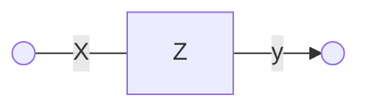

#### Основные характеристики кусочно-линейного агрегата

**Состояние** -- Каждый агрегат имеет определённое состояние, которое может изменяться со временем. Состояния описываются с помощью переменных или параметров.

**Функция перехода**.-- определяет условия, при которых происходит переход агрегата из одного состояния в другое. Она может быть задана в виде таблицы, графика или аналитического выражения.

**Выходная функция**. -- описывает реакцию агрегата на внешние воздействия или события. Она также может быть линейной или нелинейной.

> Пример кусочно-линейного агрегата — модель потребительского спроса. В этой модели каждый потребитель описывается как агрегат с двумя состояниями: «покупает» и «не покупает». Функция перехода зависит от цены товара, дохода потребителя и других факторов. Выходная функция показывает количество товара, которое потребитель готов купить при данной цене.

## 15. Схема сопряжения. Агрегативная система

### Схема сопряжения


**Схема сопряжения** — это графическое представление взаимодействия между кусочно линейными агрегатами(КЛА). Она показывает, как данные и сигналы передаются между этими компонентами, где КЛА связаны через каналы связи, по которым передаются сигналы.

Схема сопряжения может быть полезна при разработке сложных систем, таких как агрегативные системы, для обеспечения правильного функционирования и взаимодействия всех компонентов.

### Агрегативная система

**Агрегативная система** представляется либо как КЛА, либо как объединение конечного числа агрегативных систем. Это объединение описывается через схему сопряжения, где КЛА связаны через каналы связи, по которым передаются сигналы.


Для создания схемы сопряжения агрегативной системы необходимо выполнить следующие шаги:

1. Определить все компоненты системы и их функции.
2. Установить связи между компонентами и определить, какие данные и сигналы будут передаваться между ними.
3. Изобразить схему сопряжения в виде графа или диаграммы.
4. Проверить правильность схемы и устранить возможные ошибки.
5. Использовать схему для разработки и тестирования системы.

> Пример схемы сопряжения для агрегативной системы может выглядеть следующим образом:
>
> - В системе есть три агрегата: А, B и C.
> - Агрегат A выполняет функцию сбора данных о состоянии системы.
> - Агрегат B выполняет функцию обработки данных и принятия решений.
> - Агрегат C выполняет функцию вывода результатов.
> - Между агрегатами A и B существует связь по данным, которая позволяет передавать информацию о состоянии системы от агрегата A к агрегату B.
> - Между агрегатом B и агрегатом C существует связь по управлению, которая позволяет агрегату B управлять работой агрегата C.
>
> Эта схема сопряжения показывает, что агрегат A собирает данные о состоянии системы и передаёт их агрегату B, который обрабатывает эти данные и принимает решения. Затем агрегат B передаёт результаты агрегату C, который выводит их на экран.

## 16. Сети Петри и их расширения. Описание структур моделируемых проблемных ситуаций в виде сетей Петри

### Сети Петри и их расширения

#### Введение в сети Петри

Сети Петри (Petri Nets) — это математический инструмент для описания и анализа дискретных событийных систем. Они были предложены Карлом Адамом Петри в 1962 году и нашли широкое применение в различных областях, таких как компьютерные науки, системная инженерия и управление процессами.

#### Основные компоненты сетей Петри

Сеть Петри состоит из следующих элементов:

- **Позиции (Places)**: Обозначаются кругами и представляют состояния или условия системы.
- **Переходы (Transitions)**: Обозначаются прямоугольниками или полосками и представляют события, которые могут изменить состояния системы.
- **Дуги (Arcs)**: Соединяют позиции с переходами или переходы с позициями, показывая направление и условия изменения состояний.
- **Фишки (Tokens)**: Обозначаются точками внутри позиций и представляют наличие ресурса или выполнение условия.

#### Пример простой сети Петри

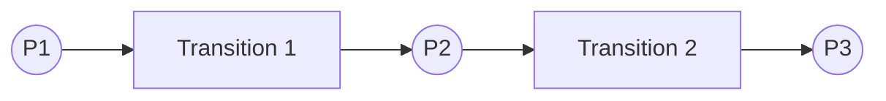

- **P1, P2, P3**: Позиции.
- **T1, T2**: Переходы.
- **Дуги**: Направление от позиций к переходам и обратно.

### Расширения сетей Петри

Для моделирования более сложных систем были предложены различные расширения стандартных сетей Петри:

1. **Цветные сети Петри (Colored Petri Nets, CPN)**
   - **Описание**: Введены цветные фишки, которые позволяют различать типы ресурсов или состояний.
   - **Применение**: Моделирование систем с различными типами объектов, например, разные типы сообщений в сетях связи.

2. **Иерархические сети Петри (Hierarchical Petri Nets)**
   - **Описание**: Включение иерархических уровней для упрощения моделирования крупных систем.
   - **Применение**: Моделирование сложных систем, таких как большие программные системы или организационные структуры.

3. **Алгебра сетей Петри (Petri Net Algebra)**
   - **Описание**: Объединение алгебраических методов для анализа и манипуляции сетями Петри.
   - **Применение**: Формальный анализ и верификация моделей.

4. **Синхронизированные сети Петри (Timed Petri Nets)**
   - **Описание**: Включение временных меток для моделирования задержек и временных ограничений.
   - **Применение**: Моделирование систем реального времени и времязависимых процессов.

5. **Стохастические сети Петри (Stochastic Petri Nets)**
   - **Описание**: Включение вероятностных элементов для моделирования неопределённости и случайных процессов.
   - **Применение**: Моделирование и анализ систем с неопределённым поведением, таких как сети связи или производственные процессы.

### Описание структур проблемных ситуаций с помощью сетей Петри

#### Пример моделируемой проблемной ситуации: Управление производственной линией

Рассмотрим пример управления производственной линией с двумя машинами и буфером. Ситуация включает следующие элементы:

- Две машины, каждая из которых может быть занята или свободна.
- Буфер для промежуточного хранения деталей.
- Процесс обработки детали машиной и перемещение детали в буфер.

#### Моделирование ситуации с помощью сети Петри

```mermaid
graph LR;
  Start((Начало)) --> M1Free((Машина 1 свободна));
  M1Free -->|Загрузка детали| T1[Начало обработки];
  T1 --> M1Busy((Машина 1 занята));
  M1Busy -->|Окончание обработки| T2[Окончание обработки];
  T2 --> Buffer((Буфер));
  Buffer -->|Перемещение детали| M2Free((Машина 2 свободна));
  M2Free -->|Загрузка детали| T3[Начало обработки];
  T3 --> M2Busy((Машина 2 занята));
  M2Busy -->|Окончание обработки| End((Конец));
  style Start fill:#3f3,color:#ff2400
  style End fill:#ff2400
  style T1 color:#fff,fill:#3a9
  style T2 color:#fff,fill:#3a9
  style T3 color:#fff,fill:#3a9
  style M1Free color:#fff,fill:#3a5
  style M1Busy color:#fff,fill:#a45
  style M2Free color:#fff,fill:#3a5
  style Buffer color:#fff,fill:#33b
  style M2Busy color:#fff,fill:#a45

```

#### Описание модели

- **Позиции**:
  - **Начало (Start)**: Начальное состояние системы.
  - **Машина 1 свободна (M1Free)**: Машина 1 готова к обработке детали.
  - **Машина 1 занята (M1Busy)**: Машина 1 обрабатывает деталь.
  - **Буфер (Buffer)**: Место хранения обработанных деталей перед передачей на машину 2.
  - **Машина 2 свободна (M2Free)**: Машина 2 готова к обработке детали.
  - **Машина 2 занята (M2Busy)**: Машина 2 обрабатывает деталь.
  - **Конец (End)**: Завершение процесса обработки.

- **Переходы**:
  - **Начало обработки (T1)**: Запуск обработки детали машиной 1.
  - **Окончание обработки (T2)**: Завершение обработки детали машиной 1 и перемещение её в буфер.
  - **Начало обработки (T3)**: Запуск обработки детали машиной 2.
  - **Окончание обработки (T4)**: Завершение обработки детали машиной 2.

- **Фишки**: Обозначают наличие деталей в различных состояниях (в машинах или в буфере).

### Заключение

Сети Петри и их расширения предоставляют мощные инструменты для моделирования, анализа и управления дискретных событийных систем. Они позволяют наглядно представить структуру и динамику сложных систем, выявить потенциальные узкие места и оптимизировать процессы. Использование различных типов сетей Петри, таких как цветные, иерархические, синхронизированные и стохастические сети Петри, позволяет адаптировать метод к конкретным задачам и характеристикам моделируемых систем.

## 17. Модели системной динамики. Парадигма и методы системной динамики

### Модели системной динамики

Системная динамика (System Dynamics) — это методика для моделирования и анализа поведения сложных систем во времени с использованием дифференциальных уравнений и обратных связей. Этот подход был разработан Джей Форрестером в 1950-х годах и активно используется для изучения систем в таких областях, как управление, экономика, экология и социология.

**Главный постулат системной динамики** _**«Структура системы
определяет поведение», а не внешние воздействия на систему**_

#### Парадигма системной динамики

Парадигма системной динамики основывается на нескольких ключевых принципах:

1. **Обратные связи (Feedback Loops)**:
   - **Положительные обратные связи (Positive Feedback Loops)**: Усиливают изменения в системе, способствуя её росту или ускорению.
   - **Отрицательные обратные связи (Negative Feedback Loops)**: Стабилизируют систему, противодействуя изменениям и способствуя равновесию.

2. **Накопление и потоки (Stocks and Flows)**:
   - **Накопления (Stocks)**: Представляют собой состояние системы в любой момент времени (например, количество ресурсов, уровень загрязнения).
   - **Потоки (Flows)**: Представляют собой изменение накоплений во времени (например, скорость потребления ресурсов, скорость загрязнения).

3. **Задержки (Delays)**:
   - Временные задержки между причиной и следствием в системе, которые могут существенно влиять на её поведение.

4. **Динамическая сложность**:
   - Системы часто проявляют сложное поведение из-за взаимодействия множества элементов и обратных связей, которые трудно предсказать.

#### Методы системной динамики

##### 1. Качественное моделирование

Качественное моделирование используется для создания концептуальных моделей, которые помогают понять структуру и поведение системы без использования точных численных данных.

- **Карта причинно-следственных связей (Causal Loop Diagram, CLD)**:
  - Представляет обратные связи в системе с помощью направленных дуг.
  - Помогает выявить основные петли обратной связи и их влияние на поведение системы.

Пример CLD:

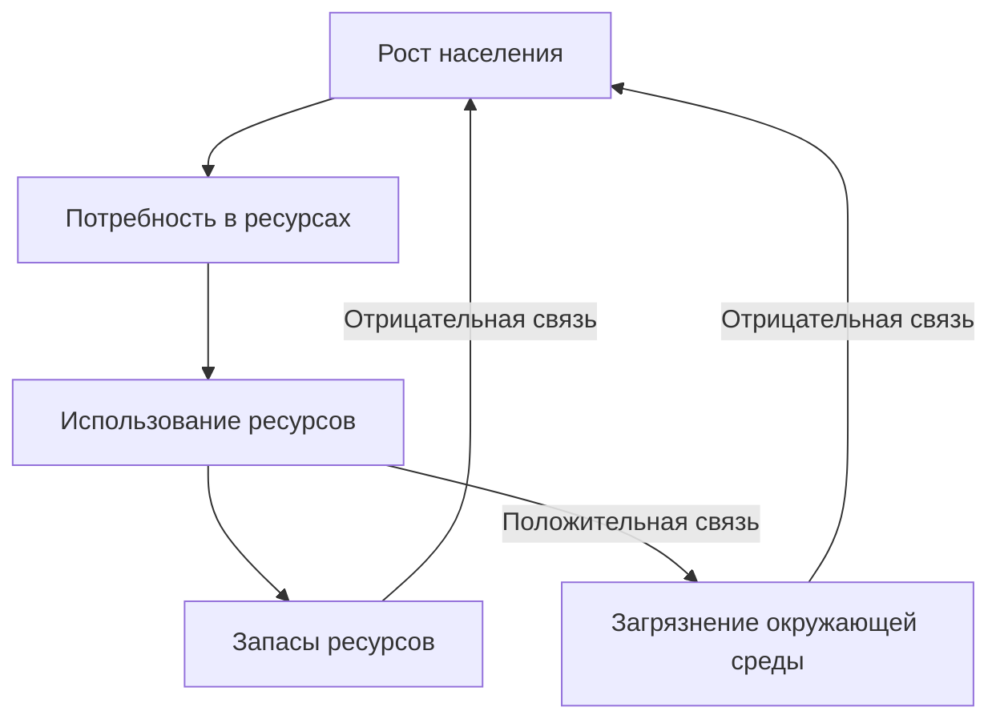

##### 2. Количественное моделирование

Количественное моделирование используется для создания математических моделей, которые позволяют проводить симуляции и делать точные прогнозы поведения системы.

- **Диаграммы накоплений и потоков (Stock and Flow Diagrams)**:
  - Представляют накопления (запасы) и потоки (изменения) в системе.
  - Включают переменные потока, которые влияют на скорость изменения накоплений.

Пример SFD:

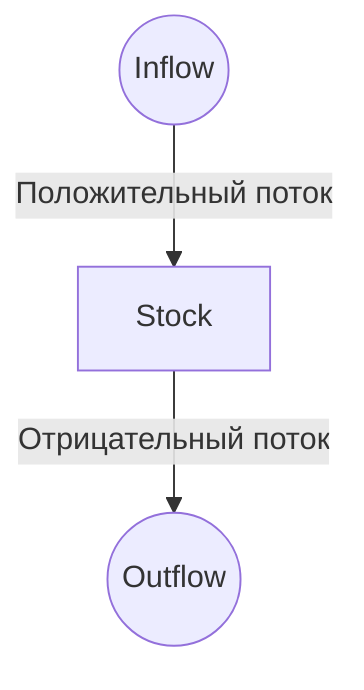

##### 3. Математическое моделирование

- Использование дифференциальных уравнений для описания изменения накоплений во времени.

##### 4. Компьютерное моделирование

- Использование специализированного программного обеспечения (например, Vensim, Stella, AnyLogic) для создания и симуляции моделей системной динамики.

#### Пример применения методов системной динамики

**Модель популяционной динамики**

- **Описание**: Модель роста популяции с учетом ограничений среды (модель Верлхюльста).
- **Накопление**: Численность популяции.
- **Потоки**: Рождаемость и смертность.

**Карта причинно-следственных связей**:


**Диаграмма накоплений и потоков**:

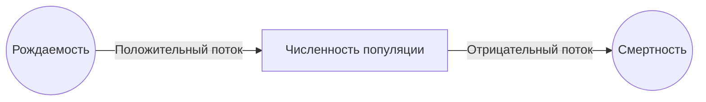

**Дифференциальное уравнение**:

$$
\frac{\partial N}{\partial t} = rN \left(1 - \frac{N}{K}\right)
$$

где $N$ — численность популяции, $r$ — коэффициент роста, $K$ — емкость среды.

### Заключение

Парадигма системной динамики и её методы предоставляют мощные инструменты для моделирования, анализа и понимания сложных систем. Использование обратных связей, накоплений и потоков позволяет исследовать динамическое поведение систем во времени и принимать обоснованные решения для управления и оптимизации этих систем.

## 18. Общая структура моделей системной динамики. Основные символы потоковых диаграмм моделей системной динамики

### Общая структура моделей системной динамики

Говоря в целом о методах разработки моделей системной динамики, их можно охарактеризовать как способы структуризации дифференциальных моделей, базирующиеся на концепции потоковой стратификации систем.

Математической (формальной) основой методов системной динамики являются дифференциальные модели, в которых используются представления динамических процессов в пространстве состояний. 

Модели системной динамики обычно включают несколько основных компонентов, которые позволяют детально описывать и анализировать поведение сложных систем во времени. Эти компоненты включают:

1. **Накопления (Stocks)**
2. **Потоки (Flows)**
3. **Переменные (Auxiliary Variables)**
4. **Параметры (Parameters)**
5. **Обратные связи (Feedback Loops)**
6. **Задержки (Delays)**

### Компоненты моделей системной динамики

#### 1. Накопления (Stocks)

Накопления представляют собой состояние системы в любой момент времени. Они могут быть физическими (например, количество товаров на складе) или нематериальными (например, уровень знаний сотрудников).

- **Обозначение на диаграмме**: Прямоугольники.
- **Пример**: Запасы воды в резервуаре.

#### 2. Потоки (Flows)

Потоки представляют собой изменения в накоплениях. Они показывают, как и с какой скоростью изменяются накопления во времени.

- **Обозначение на диаграмме**: Стрелки с клапанами (обычно указываются направление потока и его величина).
- **Пример**: Входящий поток воды в резервуар и исходящий поток воды из резервуара.

#### 3. Переменные (Auxiliary Variables)

Переменные используются для промежуточных вычислений и могут влиять на потоки и накопления. Они помогают упростить модель и сделать ее более понятной.

- **Обозначение на диаграмме**: Овалы.
- **Пример**: Скорость испарения воды, зависящая от температуры.

#### 4. Параметры (Parameters)

Параметры представляют собой фиксированные значения, которые используются для настройки модели. Они могут включать коэффициенты, константы и другие фиксированные значения.

- **Пример**: Коэффициент рождаемости, коэффициент смертности.

#### 5. Обратные связи (Feedback Loops)

Обратные связи показывают, как изменение одной части системы влияет на другие части и возвращается обратно, влияя на исходное изменение. Существуют положительные и отрицательные обратные связи.

- **Положительная обратная связь**: Усиливает изменения (например, экономический рост).
- **Отрицательная обратная связь**: Стабилизирует систему (например, терморегуляция).

#### 6. Задержки (Delays)

Задержки представляют собой временные задержки между причиной и следствием в системе. Они могут существенно влиять на динамику системы.

- **Пример**: Задержка в обучении новых сотрудников перед тем, как они станут продуктивными.

#### Пример структуры модели системной динамики

Рассмотрим пример модели системной динамики для управления запасами в магазине.

**Описание проблемы**: Необходимо моделировать уровень запасов товаров на складе и процессы пополнения и продаж.

**Основные компоненты модели**:

1. **Накопления**: Уровень запасов.
2. **Потоки**: Заказы (входящий поток), продажи (исходящий поток).
3. **Переменные**: Скорость продаж, время доставки заказа.
4. **Параметры**: Средний объем заказа, среднее время продажи одного товара.
5. **Обратные связи**: Увеличение запасов приводит к увеличению продаж (положительная обратная связь), снижение запасов приводит к заказу новых товаров (отрицательная обратная связь).
6. **Задержки**: Время между заказом товара и его поступлением на склад.

**Диаграмма структуры модели**:

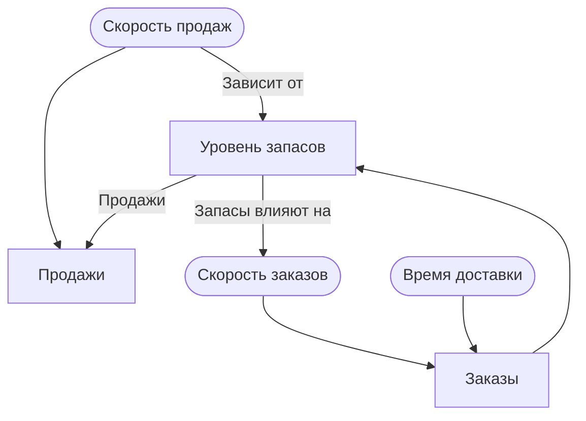

##### Объяснение модели

1. **Уровень запасов**: Представляет количество товаров на складе.
2. **Продажи (исходящий поток)**: Уменьшают уровень запасов со скоростью, зависящей от переменной скорости продаж.
3. **Заказы (входящий поток)**: Увеличивают уровень запасов со скоростью, зависящей от переменной скорости заказов.
4. **Скорость продаж**: Зависит от уровня запасов (чем больше запасов, тем больше продаж).
5. **Скорость заказов**: Зависит от уровня запасов (чем меньше запасов, тем больше скорость заказов для пополнения).
6. **Время доставки**: Влияет на скорость поступления заказов на склад, создавая задержку.

#### Заключение

Модели системной динамики обеспечивают структурированный подход к пониманию и анализу сложных систем. Использование накоплений, потоков, переменных, параметров, обратных связей и задержек позволяет создавать подробные и точные модели, которые могут помочь в принятии управленческих решений и оптимизации процессов.

### Основные символы потоковых диаграмм моделей системной динамики

Потоковые диаграммы (Stock and Flow Diagrams, SFD) моделей системной динамики используют различные символы для представления накоплений, потоков, переменных и их взаимодействий. Ниже приведены основные символы, используемые в таких диаграммах:

#### 1. Накопления (Stocks)

- **Обозначение**: Прямоугольники
- **Описание**: Представляют собой состояние системы в любой момент времени, хранят количество ресурса или уровень какого-либо параметра.
- **Примеры**: Запасы воды в резервуаре, количество товаров на складе, численность населения.

#### 2. Потоки (Flows)

- **Обозначение**: Стрелки с клапанами
- **Описание**: Представляют собой изменения в накоплениях во времени, показывают направление и скорость изменений.
- **Примеры**: Входящий поток воды в резервуар (inflow), исходящий поток воды из резервуара (outflow), скорость продаж товаров.

#### 3. Переменные (Auxiliary Variables)

- **Обозначение**: Овалы
- **Описание**: Промежуточные вычисления или вспомогательные параметры, которые влияют на потоки и накопления.
- **Примеры**: Скорость испарения воды, коэффициент рождаемости, скорость потребления ресурса.

#### 4. Параметры (Parameters)

- **Обозначение**: Текстовые метки (без специальных графических символов)
- **Описание**: Фиксированные значения, используемые для настройки модели. Они могут быть константами или коэффициентами.
- **Примеры**: Коэффициент смертности, максимальная емкость резервуара.

#### 5. Обратные связи (Feedback Loops)

- **Обозначение**: Замкнутые циклы со стрелками
- **Описание**: Показывают, как изменение одной части системы влияет на другие части и возвращается обратно, влияя на исходное изменение.
- **Примеры**: Положительные обратные связи (усиливают изменения, например, экономический рост), отрицательные обратные связи (стабилизируют систему, например, регуляция температуры).

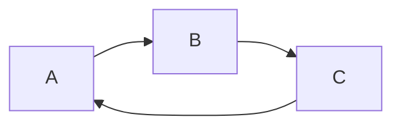

#### 6. Задержки (Delays)

- **Обозначение**: Волнистые стрелки или текстовые обозначения рядом с потоками
- **Описание**: Временные задержки между причиной и следствием в системе, которые могут существенно влиять на её поведение.
- **Примеры**: Время между заказом товара и его поступлением на склад, задержка в обучении новых сотрудников.

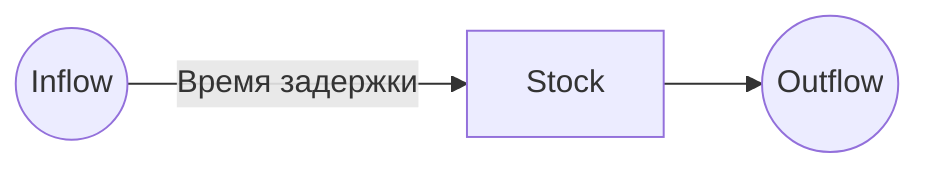
### Таблица с основными графическими отображениями 

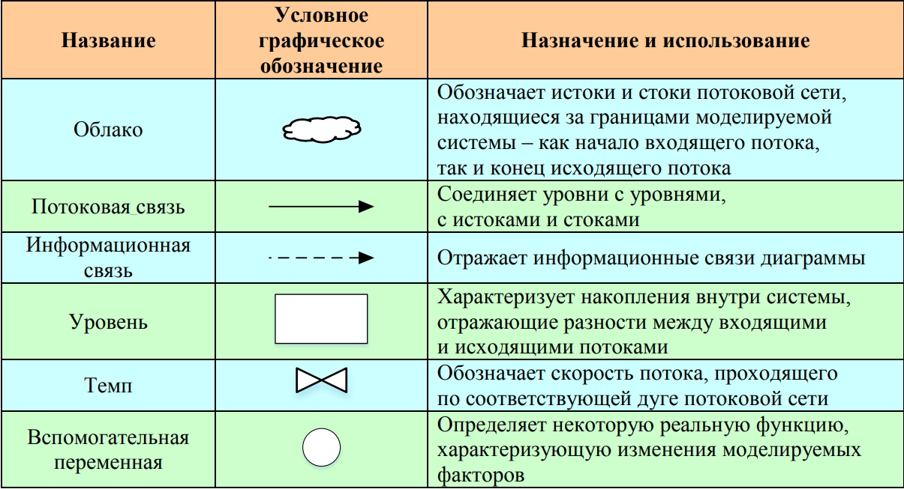

### Пример использования основных символов в потоковой диаграмме

Рассмотрим пример модели управления запасами товаров в магазине, где используются все основные символы:

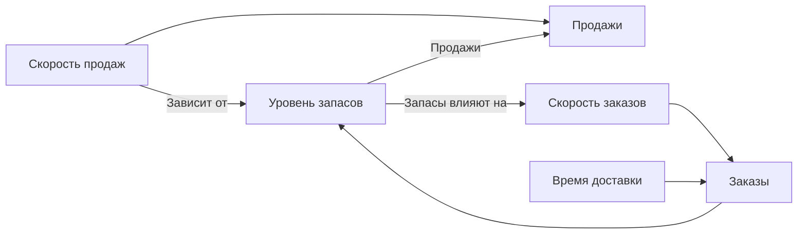

### Объяснение модели

1. **Уровень запасов (Stock)**: Количество товаров на складе.
2. **Продажи (Outflow)**: Уменьшают уровень запасов со скоростью, определяемой переменной **скорость продаж (Sales Rate)**.
3. **Заказы (Inflow)**: Увеличивают уровень запасов со скоростью, определяемой переменной **скорость заказов (Order Rate)**.
4. **Скорость продаж (Sales Rate)**: Переменная, зависящая от уровня запасов (чем больше запасов, тем больше скорость продаж).
5. **Скорость заказов (Order Rate)**: Переменная, зависящая от уровня запасов (чем меньше запасов, тем больше скорость заказов для пополнения).
6. **Время доставки (Time Delay)**: Влияет на скорость поступления заказов на склад, создавая временную задержку.

### Заключение

Использование основных символов потоковых диаграмм моделей системной динамики позволяет наглядно представить структуру и динамику сложных систем. Эти символы помогают моделировать взаимодействия между различными компонентами системы, анализировать влияние различных факторов и прогнозировать поведение системы во времени.

## 19. Понятие о модельном времени. Механизм продвижения модельного времени. Дискретные и непрерывные имитационные модели

### Понятие о модельном времени

Модельное время — это концепция, используемая в математическом и компьютерном моделировании для представления течения времени в симулируемой системе. Оно позволяет отслеживать изменения состояния системы во времени и анализировать динамические процессы. Модельное время может отличаться от реального времени в зависимости от целей и особенностей модели.

#### Основные характеристики модельного времени

1. **Дискретное и непрерывное время**
   - **Дискретное время**: Временные шаги фиксированы, и состояние системы обновляется в определенные моменты времени. Подходит для систем, где изменения происходят в конкретные моменты, например, ежемесячные финансовые отчеты.
   - **Непрерывное время**: Время рассматривается как непрерывное, и изменения состояния системы описываются дифференциальными уравнениями. Подходит для систем, где изменения происходят непрерывно, например, химические реакции.

2. **Шаг времени (Time Step)**
   - **Длина временного шага**: Интервал времени между двумя последовательными моментами в дискретной модели. Выбор шага времени влияет на точность и производительность модели.
   - **Изменяемый шаг времени**: В некоторых моделях шаг времени может изменяться в зависимости от условий и требований к точности.

3. **Масштаб времени**
   - **Абсолютное время**: Время моделирования соотносится с реальным временем (например, минуты, часы, дни).
   - **Относительное время**: Время моделирования может быть абстрактным и не иметь прямой связи с реальным временем (например, симуляционные шаги).

4. **Инициализация времени**
   - Модельное время начинается с начального момента (обычно $t = 0$) и увеличивается до конечного момента, определенного условиями задачи.

5. **Событийное время**
   - В некоторых моделях время определяется не фиксированными шагами, а событиями, происходящими в системе. Это характерно для имитационного моделирования, где состояние системы обновляется в моменты возникновения значимых событий.

#### Заключение

Модельное время является важной концепцией в математическом и компьютерном моделировании. Оно позволяет исследовать динамическое поведение систем во времени, анализировать их состояние и прогнозировать развитие. Выбор подхода к представлению времени (дискретное или непрерывное, фиксированный или изменяемый шаг времени) зависит от целей моделирования и специфики исследуемой системы.

### Механизм продвижения модельного времени

Механизм продвижения модельного времени определяет, как модель обновляет свое состояние во времени. В зависимости от типа модели и специфики задачи, этот механизм может быть разным. Основные подходы включают использование фиксированного временного шага и событийное продвижение времени.

#### 1. Фиксированный временной шаг (Time Stepping)

При использовании фиксированного временного шага модельное время продвигается равномерно на каждый шаг. Этот подход подходит для моделей с дискретным временем, где изменения происходят в фиксированные моменты времени.

**Шаги процесса:**

1. **Инициализация**: Задание начальных условий и начального времени $t = 0$.
2. **Обновление состояния**: На каждом шаге $\Delta t$ вычисляются новые значения переменных состояния.
3. **Инкремент времени**: Время увеличивается на $\Delta t$ (то есть $t = t + \Delta t$).
4. **Проверка завершения**: Если достигнуто конечное время моделирования, процесс завершен, иначе повторить шаги 2 и 3.

**Пример:**

Рассмотрим модель популяции с фиксированным временным шагом $\Delta t = 1$ год:

$$
\begin{aligned}
    P(t + \Delta t) &= P(t) + \Delta t \cdot r \cdot P(t) \left(1 - \frac{P(t)}{K}\right) \\
    t &= t + \Delta t
\end{aligned}
$$

где $P(t)$ — численность популяции в момент времени $t$, $r$ — коэффициент роста популяции, $K$ — максимальная ёмкость среды.

**Псевдокод:**

```pseudo
initialize P, t
while t < t_end:
    P = P + Δt * r * P * (1 - P / K)
    t = t + Δt
```

#### 2. Событийное продвижение времени (Event-Based Time Advancement)

При событийном продвижении времени модельное время продвигается от одного события к другому. Этот подход используется в имитационном моделировании, где состояние системы обновляется в моменты возникновения событий.

**Шаги процесса:**

1. **Инициализация**: Задание начальных условий и начального времени $t = 0$.
2. **Обработка событий**: Выбор ближайшего события из списка событий.
3. **Обновление состояния**: Обновление состояния системы в момент события.
4. **Инкремент времени**: Время продвигается к моменту события $t = t_{\text{event}}$.
5. **Планирование новых событий**: Планирование новых событий, вызванных текущим событием.
6. **Проверка завершения**: Если достигнуто конечное время моделирования или список событий пуст, процесс завершен, иначе повторить шаги 2-5.

**Пример:**

Рассмотрим модель обслуживания клиентов в очереди:

1. События: приход клиента, завершение обслуживания клиента.
2. Приход клиента: добавление клиента в очередь, планирование следующего прихода клиента.
3. Завершение обслуживания клиента: удаление клиента из очереди, планирование завершения обслуживания следующего клиента.

**Псевдокод:**

```pseudo
initialize event_list, t
while t < t_end:
    event = get_next_event(event_list)
    t = event.time
    process_event(event)
    update_event_list(event_list)
```

##### Пример с использованием фиксированного шага времени

Рассмотрим модель эпидемии с фиксированным временным шагом. Пусть есть начальная численность популяции $S(0) = 990$, инфицированных $I(0) = 10$, выздоровевших $R(0) = 0$, шаг времени $(\Delta t = 1)$ день, время моделирования 100 дней.

**Дифференциальные уравнения для непрерывного времени:**

$$
\begin{aligned}
    \frac{\partial S}{dt} &= -\beta S I \\
    \frac{\partial I}{\partial t} &= \beta S I - \gamma I \\
    \frac{\partial R}{\partial t} &= \gamma I
\end{aligned}
$$

**Дискретизация:**

$$
\begin{aligned}
    S(t + \Delta t) &= S(t) - \Delta t \cdot \beta S(t) I(t) \\
    I(t + \Delta t) &= I(t) + \Delta t \cdot (\beta S(t) I(t) - \gamma I(t)) \\
    R(t + \Delta t) &= R(t) + \Delta t \cdot \gamma I(t)
\end{aligned}
$$

**Псевдокод:**

```pseudo
initialize S = 990, I = 10, R = 0, t = 0
while t < 100:
    new_S = S - Δt * β * S * I
    new_I = I + Δt * (β * S * I - γ * I)
    new_R = R + Δt * γ * I
    S = new_S
    I = new_I
    R = new_R
    t = t + Δt
```

#### Заключение

Механизм продвижения модельного времени — это важный аспект моделирования, который определяет, как модель обновляет свое состояние и продвигает время. Выбор подхода (фиксированный временной шаг или событийное продвижение времени) зависит от специфики задачи и типа модели. Понимание этих механизмов позволяет эффективно строить и анализировать модели сложных систем.

### Дискретные и непрерывные имитационные модели

Имитационные модели используются для воспроизведения и анализа поведения сложных систем. В зависимости от природы моделируемых процессов они могут быть разделены на дискретные и непрерывные. Каждая из этих категорий имеет свои особенности и области применения.

#### Дискретные имитационные модели

Дискретные имитационные модели (Discrete Event Simulation, DES) моделируют системы, где изменения происходят в определенные моменты времени, вызванные событиями. Эти изменения дискретны, и система остается в неизменном состоянии между событиями.

**Основные характеристики:**

- **События**: Основные изменения состояния происходят в определенные моменты времени.
- **Временные шаги**: Моделирование продвигается от одного события к другому, без фиксированных временных шагов.
- **Примеры**: Модели очередей, системы обслуживания, логистические процессы, производственные системы.

**Пример: Модель очереди в банке**

- **События**: Приход клиента, начало обслуживания, завершение обслуживания.
- **Состояние системы**: Число клиентов в очереди, состояние кассовых окон (заняты или свободны).
- **Алгоритм**:
  1. Инициализация начальных условий.
  2. Планирование первого события (приход клиента).
  3. Обработка событий по мере их наступления.
  4. Обновление состояния системы и планирование новых событий.


#### Непрерывные имитационные модели

Непрерывные имитационные модели (Continuous Simulation) описывают системы, где изменения происходят непрерывно во времени. Эти изменения обычно моделируются дифференциальными уравнениями.

**Основные характеристики:**

- **Непрерывное время**: Время считается непрерывным, и состояние системы может изменяться в любой момент.
- **Дифференциальные уравнения**: Используются для описания динамики системы.
- **Примеры**: Физические процессы, химические реакции, экологические модели, экономические модели.

**Пример: Модель роста популяции**

- **Дифференциальные уравнения**:
$
 \frac{dP}{dt} = rP \left(1 - \frac{P}{K}\right)
$
  где $P$ — численность популяции, $r$ — коэффициент роста, $K$ — ёмкость среды.
- **Методы численного интегрирования**: Для решения уравнений могут использоваться методы, такие как метод Эйлера или метод Рунге-Кутты.


#### Сравнение дискретных и непрерывных имитационных моделей

| **Характеристика**             | **Дискретные модели (DES)**        | **Непрерывные модели**               |
|------------------------------|----------------------------------|-------------------------------------|
| **Природа времени**          | Дискретное, события              | Непрерывное                         |
| **Основные компоненты**      | События, очереди                 | Дифференциальные уравнения          |
| **Примеры**                  | Очереди, логистика, производственные системы | Физические, химические, экологические процессы |
| **Методы анализа**           | Событийное моделирование         | Численное интегрирование            |
| **Подход к времени**         | Временные шаги между событиями   | Непрерывное изменение состояния     |
| **Преимущества**             | Подходит для систем с явными событиями | Подходит для систем с непрерывной динамикой |
| **Недостатки**               | Может быть сложным для систем с высокой частотой событий | Требует сложных методов численного решения |

#### Пример использования обеих моделей для одной задачи

**Задача**: Моделирование заражения и распространения болезни.

**Дискретная модель**:

- **События**: Инфицирование, выздоровление, смерть.
- **Алгоритм**:
  1. Инициализация начальных условий.
  2. Планирование событий (например, время заражения новых людей).
  3. Обработка событий по мере их наступления.

**Непрерывная модель**:

- **Дифференциальные уравнения**:
  $$
  \begin{aligned}
    \frac{dS}{dt} &= -\beta SI \\
    \frac{dI}{dt} &= \beta SI - \gamma I \\
    \frac{dR}{dt} &= \gamma I
  \end{aligned}
  $$
- **Методы**: Численное решение уравнений, такие как метод Эйлера или метод Рунге-Кутты.

#### Заключение

Дискретные и непрерывные имитационные модели предоставляют мощные инструменты для анализа и понимания поведения сложных систем. Выбор между этими подходами зависит от природы моделируемой системы и целей исследования. Понимание их особенностей и методов позволяет эффективно использовать их для решения широкого спектра задач.

## 20. Проблемы стратегического и тактического планирования имитационного эксперимента. Направленный вычислительный эксперимент на имитационной модели

### Проблемы стратегического и тактического планирования имитационного эксперимента

Имитационное моделирование — мощный инструмент для анализа сложных систем, но успешное его применение требует тщательного планирования на стратегическом и тактическом уровнях. Каждый уровень имеет свои специфические проблемы и вызовы.

#### Стратегическое планирование

Стратегическое планирование включает в себя определение общих целей и задач имитационного эксперимента, а также выбор подходов и методов для их достижения. Основные проблемы, возникающие на этом уровне, включают:

1. **Определение целей эксперимента**
   - **Проблема**: Неясные или противоречивые цели могут привести к неправильной интерпретации результатов.
   - **Решение**: Четкое формулирование целей и задач эксперимента с участием всех заинтересованных сторон.

2. **Выбор модели и методологии**
   - **Проблема**: Выбор неподходящей модели или методологии может сделать результаты эксперимента недостоверными.
   - **Решение**: Анализ и оценка различных моделей и методов, выбор наиболее подходящих для конкретной задачи.

3. **Сбор данных и их качество**
   - **Проблема**: Недостаток или низкое качество данных может существенно снизить точность модели.
   - **Решение**: Обеспечение надежных источников данных, проверка и очистка данных перед использованием.

4. **Оценка затрат и ресурсов**
   - **Проблема**: Нехватка ресурсов (времени, финансов, персонала) может ограничить возможности проведения эксперимента.
   - **Решение**: Реалистичное планирование бюджета и ресурсов, привлечение необходимого финансирования и специалистов.

5. **Учет неопределенностей и рисков**
   - **Проблема**: Неопределенности и риски могут повлиять на точность и надежность результатов.
   - **Решение**: Идентификация и анализ возможных неопределенностей и рисков, разработка стратегий их минимизации.

#### Тактическое планирование

Тактическое планирование включает в себя конкретные шаги по реализации имитационного эксперимента, управление процессом моделирования и анализ результатов. Основные проблемы на этом уровне включают:

1. **Разработка модели**
   - **Проблема**: Сложность и трудоемкость процесса разработки и верификации модели.
   - **Решение**: Использование стандартизированных подходов и инструментов, регулярная проверка модели на адекватность и корректность.

2. **Калибровка и валидация модели**
   - **Проблема**: Трудности в калибровке модели и подтверждении ее точности.
   - **Решение**: Постоянная валидация модели с использованием реальных данных, привлечение экспертов для проверки корректности модели.

3. **Проведение экспериментов**
   - **Проблема**: Определение правильного числа и условий экспериментов для получения статистически значимых результатов.
   - **Решение**: Использование методов планирования экспериментов, проведение пилотных испытаний для настройки условий.

4. **Анализ и интерпретация результатов**
   - **Проблема**: Сложности в интерпретации результатов и их применении к реальным задачам.
   - **Решение**: Привлечение специалистов для анализа результатов, использование визуализаций и аналитических методов для представления данных.

5. **Документирование и отчетность**
   - **Проблема**: Недостаточная документация может затруднить понимание и повторение эксперимента.
   - **Решение**: Подробное документирование всех этапов эксперимента, создание отчетов с четким описанием методологии, результатов и выводов.

#### Сравнение стратегического и тактического планирования

| **Аспект**                     | **Стратегическое планирование**                           | **Тактическое планирование**                              |
|--------------------------------|-----------------------------------------------------------|-----------------------------------------------------------|
| **Основной фокус**             | Определение целей, выбор методологии, оценка ресурсов     | Разработка модели, проведение экспериментов, анализ результатов |
| **Проблемы**                   | Четкость целей, выбор методов, качество данных            | Верификация модели, настройка экспериментов, интерпретация результатов |
| **Решения**                    | Участие всех сторон, анализ методов, проверка данных      | Стандартизированные инструменты, привлечение экспертов    |
| **Ресурсы и время**            | Планирование бюджета и ресурсов                           | Реализация и управление ресурсами                         |
| **Учет неопределенностей**     | Идентификация и анализ рисков                             | Корректировка модели и условий экспериментов              |

#### Заключение

Стратегическое и тактическое планирование имитационного эксперимента являются ключевыми аспектами успешного моделирования сложных систем. Каждое из них сталкивается со своими уникальными проблемами, которые требуют соответствующих решений и подходов. Эффективное планирование на обоих уровнях позволяет минимизировать риски, обеспечить точность и надежность модели, а также получить ценные результаты, применимые к реальным задачам.

### Направленный вычислительный эксперимент на имитационной модели

Направленный вычислительный эксперимент на имитационной модели (focused computational experiment) — это целенаправленное исследование, которое проводится для изучения конкретных аспектов поведения модели и для получения ответов на заранее сформулированные вопросы. В отличие от общего моделирования, направленный эксперимент концентрируется на определенных параметрах и сценариях.

#### Основные этапы проведения направленного вычислительного эксперимента

1. **Постановка целей и задач эксперимента**
   - **Цель**: Определение конкретного аспекта или параметра системы, который будет исследован.
   - **Задачи**: Формулирование вопросов, на которые эксперимент должен дать ответы.

2. **Определение параметров и сценариев**
   - **Параметры**: Выбор ключевых параметров модели, которые будут изменяться в ходе эксперимента.
   - **Сценарии**: Определение различных условий и начальных состояний, которые будут исследоваться.

3. **Разработка плана эксперимента**
   - **Методология**: Определение методов и инструментов, которые будут использоваться для проведения эксперимента.
   - **Планирование**: Создание детального плана проведения эксперимента, включая временные рамки, последовательность шагов и распределение ресурсов.

4. **Проведение пилотных испытаний**
   - **Тестирование модели**: Проверка модели на адекватность и корректность перед проведением основного эксперимента.
   - **Анализ результатов пилотных испытаний**: Корректировка модели и плана эксперимента на основе полученных данных.

5. **Проведение основного эксперимента**
   - **Сбор данных**: Запуск модели с различными параметрами и сценариями, сбор данных о поведении системы.
   - **Мониторинг**: Наблюдение за ходом эксперимента, фиксация результатов и возможных отклонений.

6. **Анализ и интерпретация результатов**
   - **Обработка данных**: Анализ собранных данных с использованием статистических и аналитических методов.
   - **Интерпретация**: Интерпретация результатов в контексте поставленных целей и задач эксперимента.

7. **Документирование и отчетность**
   - **Отчет**: Составление детального отчета с описанием методологии, результатов и выводов.
   - **Документация**: Подробное документирование всех этапов эксперимента для возможности его повторения и проверки.

#### Пример направленного вычислительного эксперимента

**Контекст**: Модель распространения инфекционного заболевания в городской популяции.

**Цель**: Исследование влияния уровня вакцинации на динамику распространения заболевания.

**Задачи**:

1. Определить критический уровень вакцинации, при котором эпидемия затухает.
2. Исследовать влияние разных уровней вакцинации на пик заболеваемости и общее число заболевших.

**Параметры**:

- Уровень вакцинации ($v$): 0%, 30%, 50%, 70%, 90%.
- Коэффициент заражения ($\beta$): фиксированный.
- Коэффициент выздоровления ($\gamma$): фиксированный.

**Сценарии**:

- Начальная численность популяции ($N$): 10000 человек.
- Начальное число инфицированных ($I_0$): 10 человек.

**План эксперимента**:

1. Инициализация модели для каждого уровня вакцинации.
2. Запуск модели и сбор данных о численности восприимчивых ($S$), инфицированных ($I$) и выздоровевших ($R$) на протяжении времени.

**Псевдокод эксперимента**:

```pseudo
initialize N = 10000, I0 = 10, R0 = 0, S0 = N - I0 - R0
for v in [0%, 30%, 50%, 70%, 90%]:
    S0 = (1 - v) * N
    I0 = 10
    R0 = v * N
    while t < t_end:
        S, I, R = update_model(S, I, R, β, γ)
        record_data(S, I, R, t)
        t = t + Δt
    analyze_data(v, recorded_data)
generate_report()
```

#### Преимущества и недостатки направленного вычислительного эксперимента

**Преимущества**:

- **Целевая направленность**: Позволяет сосредоточиться на конкретных аспектах и получить детализированные результаты.
- **Эффективность**: Оптимальное использование ресурсов за счет четкой постановки целей и задач.
- **Информативность**: Предоставляет возможность глубокой интерпретации результатов и формулировки конкретных выводов.

**Недостатки**:

- **Ограниченность**: Фокус на узком аспекте может пропустить важные взаимодействия и эффекты.
- **Требовательность к данным**: Высокие требования к качеству и количеству данных для достоверного анализа.
- **Сложность интерпретации**: Полученные результаты могут быть сложны для интерпретации без должного контекста и понимания системы.

#### Заключение

Направленный вычислительный эксперимент на имитационной модели представляет собой мощный инструмент для изучения конкретных аспектов сложных систем. Он требует тщательного планирования, четкой постановки целей и задач, а также корректного анализа и интерпретации результатов. Эффективное проведение таких экспериментов позволяет получить ценные инсайты и принять обоснованные решения на основе моделирования.
